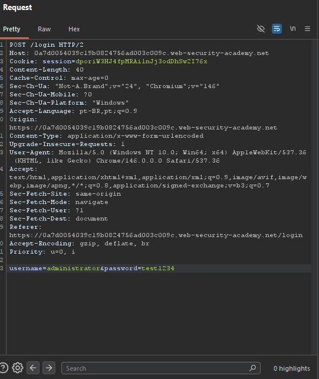
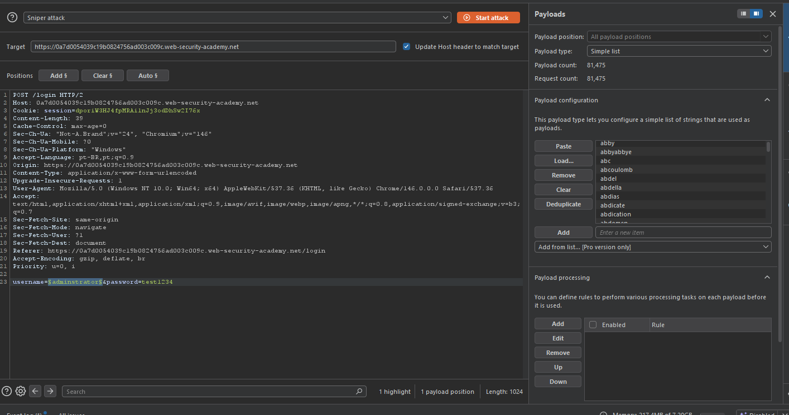
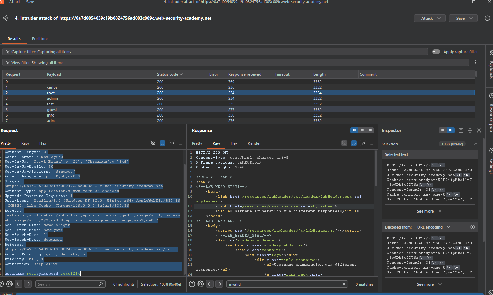
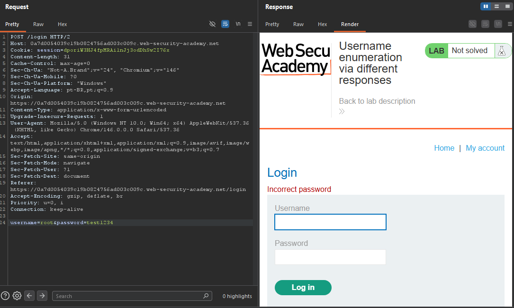
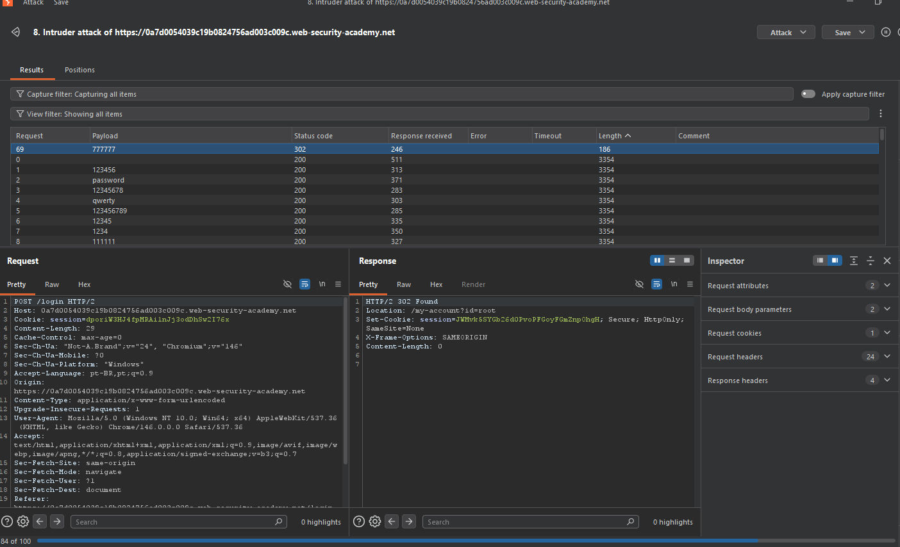

# Broken Authentication — Username Enumeration via Different Responses

## Contexto

A aplicação permite enumeração de usuários porque retorna mensagens de erro diferentes dependendo se o username existe ou não ("Invalid username" vs "Invalid password"). Além disso, não possui rate limiting, permitindo ataques de brute force sem bloqueio.

**Lab:** [Username enumeration via different responses](https://portswigger.net/web-security/authentication/password-based/lab-username-enumeration-via-different-responses)

---

## Análise Inicial

Acessando `/login`, observei que não há CAPTCHA, rate limiting visível ou bloqueio por IP — qualquer requisição de login podia ser repetida livremente.

Capturei a requisição no Burp Suite:

```http
POST /login HTTP/2
Host: 0a7d0054039c19b0824756ad003c009c.web-security-academy.net
Content-Type: application/x-www-form-urlencoded

username=administrator&password=test1234
```



---

## Exploração

### Fase 1: Enumeração de Usuários

Enviei a requisição para o **Intruder** (modo Sniper) com o payload posicionado no parâmetro `username`.

- **Wordlist:** usernames fornecida pelo lab (81.475 entradas)
- **Filtro:** procurei respostas diferentes de "Invalid username"



Resultado: o usuário **root** retornou a mensagem "Invalid password" — confirmando que o username existia na aplicação.




---

### Fase 2: Brute Force da Senha

Com o usuário confirmado, repeti o ataque no parâmetro `password`:

- **Wordlist:** passwords fornecida pelo lab
- **Filtro:** coluna Length (tamanho da resposta) + status code 302

Payload bem-sucedido: `777777`  
Credenciais válidas: `root` / `777777`

Request de sucesso:

```http
POST /login HTTP/2
Host: 0a7d0054039c19b0824756ad003c009c.web-security-academy.net

username=root&password=777777
```

Response:

```
HTTP/2 302 Found
Location: /my-account?id=root
```



---

## Impacto

- Mensagens de erro distintas permitem confirmar usuários válidos antes de atacar senhas — reduz drasticamente o espaço de busca.
- Ausência de rate limiting torna o ataque totalmente automatizável e escalável.
- A combinação dos dois vetores resulta em takeover de conta com esforço mínimo.

---

## Mitigação

- Retornar sempre a mesma mensagem genérica ("Credenciais inválidas") independentemente do campo incorreto.
- Implementar rate limiting por IP e por conta após tentativas consecutivas.
- Bloqueio temporário após X falhas seguidas.
- CAPTCHA em fluxos de autenticação sob alta taxa de requisição.
- Logging e monitoramento de tentativas de login anômalas.

---

## Aprendizados

- Mensagens de erro diferentes são um vetor clássico de username enumeration — simples de testar, alto impacto.
- Combinar enumeração + brute force é extremamente eficaz quando não há proteções no fluxo de autenticação.
- Sempre testar rate limiting, bloqueio de conta e variação nas mensagens de erro em qualquer formulário de login.
