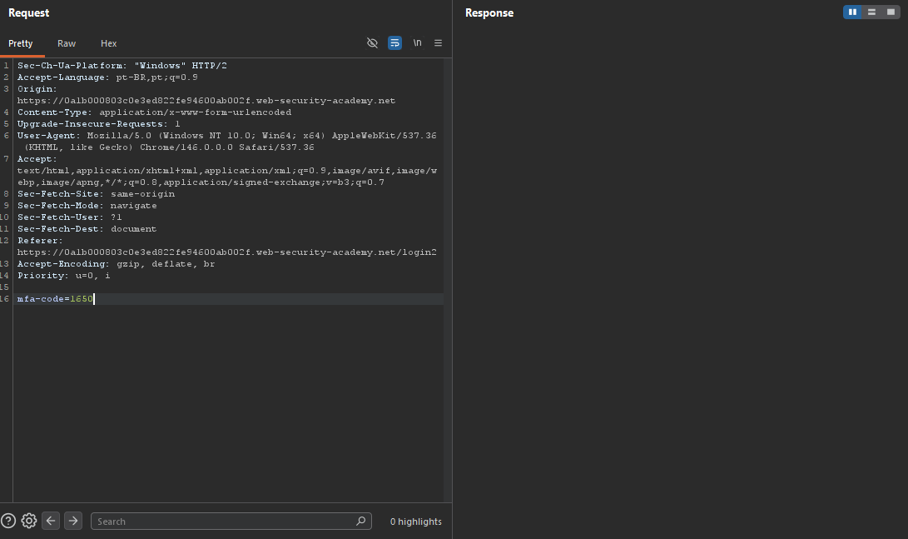
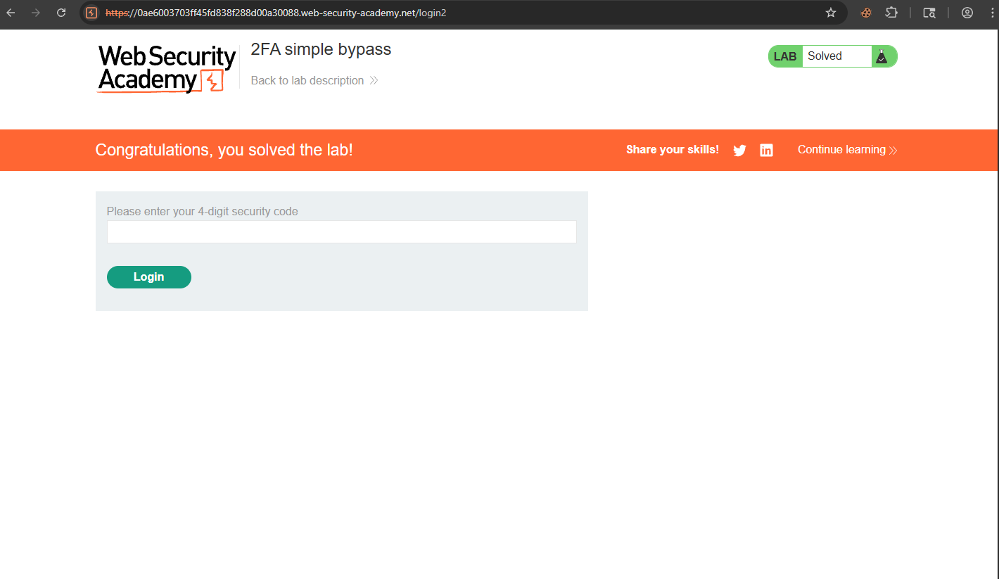
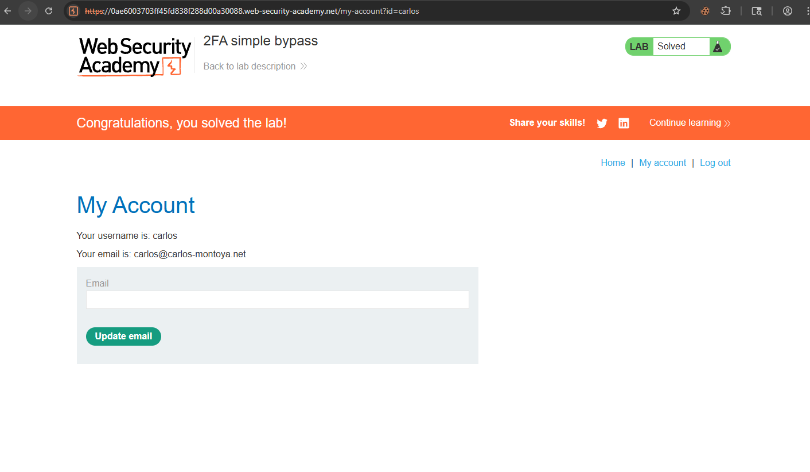

# Broken Authentication — 2FA Simple Bypass

## Contexto

A aplicação implementa autenticação em duas etapas, mas não valida se o usuário realmente completou o fluxo de 2FA antes de acessar páginas autenticadas. A sessão é criada após o primeiro login — o segundo fator é apenas uma verificação superficial que pode ser ignorada navegando diretamente para a URL protegida.

**Lab:** [2FA simple bypass](https://portswigger.net/web-security/authentication/multi-factor/lab-2fa-simple-bypass)

---

## Análise Inicial

O lab fornece duas contas:
- **wiener:peter** — conta própria com acesso ao email (código 2FA disponível)
- **carlos:montoya** — conta alvo sem acesso ao email

Fiz login com `wiener:peter` e observei o fluxo completo:

1. `POST /login` com usuário e senha → sessão criada
2. Redirecionamento para `/login2` solicitando código 2FA
3. Após código correto → redirecionamento para `/my-account?id=wiener`

A URL final revelou o padrão: `/my-account?id=wiener`. O parâmetro `id` na URL controlava qual conta estava sendo exibida — mesmo padrão de IDOR estudado no módulo de Access Control.

---

## Exploração

### Tentativas iniciais

Tentei interceptar a requisição do código 2FA no Burp e substituir o valor — sem sucesso. A validação do código em si estava funcionando corretamente.



O problema não era o código — era que a aplicação não verificava se o usuário tinha *passado* pelo 2FA antes de servir a página autenticada.

### Bypass

Fiz login com `carlos:montoya`. A aplicação redirecionou para `/login2` pedindo o código 2FA — código que não tenho acesso.

Em vez de tentar o código, naveguei diretamente para:

```
/my-account?id=carlos
```

A aplicação serviu a página autenticada de Carlos sem exigir o 2FA.




---

## Por que funcionou

A sessão é criada no primeiro fator — após `POST /login` com usuário e senha corretos, o servidor já considera o usuário autenticado internamente. O `/login2` é apenas uma verificação adicional na interface, mas o servidor não bloqueia acesso a rotas protegidas para sessões que não completaram o 2FA. Navegar direto para `/my-account?id=carlos` simplesmente pulou essa verificação.

---

## Impacto

Qualquer atacante com as credenciais de senha (obtidas via phishing, brute force ou vazamento) consegue acesso completo à conta mesmo com 2FA ativado. O segundo fator se torna completamente inútil — a proteção existe só na interface, não no servidor.

---

## Mitigação

O servidor deve verificar, a cada requisição para área autenticada, se a sessão completou todos os fatores de autenticação exigidos. Uma flag de sessão como `2fa_verified: true` deve ser obrigatória antes de servir qualquer rota protegida — não apenas redirecionar para `/login2` na interface.

---

## Aprendizados

- 2FA implementado só no front-end não oferece proteção real — a validação precisa estar no servidor.
- Conectar conceitos entre módulos é fundamental: o bypass aqui usou a mesma lógica de IDOR (manipulação de parâmetro `id` na URL) aplicada a um contexto de autenticação.
- Sempre testar se é possível pular etapas do fluxo de autenticação navegando diretamente para URLs protegidas.
- A ausência de verificação server-side de estado da sessão é um dos erros mais comuns em implementações de MFA.
