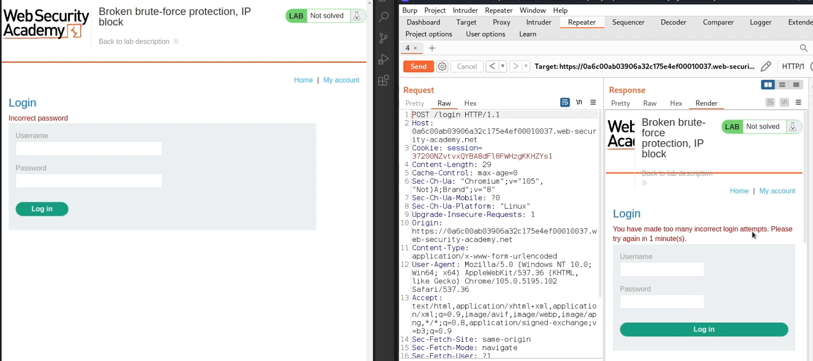
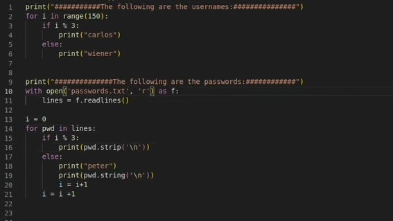
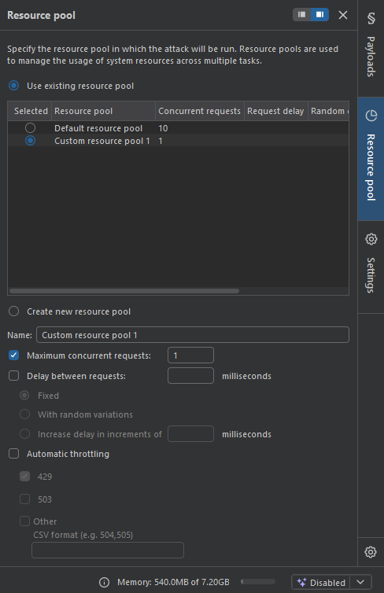
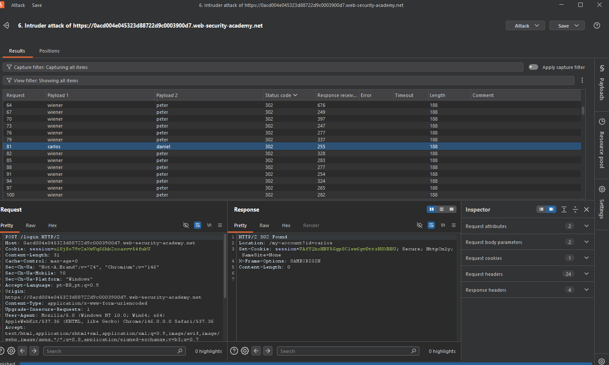

# Broken Authentication — Broken Brute-Force Protection, IP Block

## Contexto

A aplicação tenta se proteger de brute force bloqueando o IP após 3 tentativas incorretas consecutivas. O problema: fazer login com sucesso **reseta esse contador**. Isso significa que se você intercalar tentativas inválidas com um login válido, nunca atinge o limite de 3 — e pode testar senhas indefinidamente.

**Lab:** [Broken brute-force protection, IP block](https://portswigger.net/web-security/authentication/password-based/lab-broken-bruteforce-via-ip-block)

---

## Análise Inicial

Testei o mecanismo de proteção manualmente: após 3 tentativas com senha errada consecutivas, a aplicação bloqueou o IP por 1 minuto.



A proteção parecia funcionar — até descobrir que logar com sucesso (usuário `wiener` com senha `peter`) resetava o contador de tentativas. Ou seja: o servidor rastreava falhas consecutivas, não falhas totais.

**A lógica vulnerável do servidor:**
```
falha → contador +1
sucesso → contador = 0   ← o problema está aqui
```

---

## A Técnica: Pitch Attack (Pitchfork)

Antes de explicar o ataque, é importante entender o modo **Pitchfork** do Burp Intruder — que é diferente do Sniper usado no lab anterior.

- **Sniper:** uma posição variável, uma wordlist. Testa cada valor naquela posição.
- **Pitchfork:** duas ou mais posições variáveis, uma wordlist para cada. Itera as listas em paralelo — request 1 usa item 1 de cada lista, request 2 usa item 2, e assim por diante.

Aqui o Pitchfork foi essencial: precisávamos controlar simultaneamente o `username` e o `password` em cada request, seguindo uma sequência específica.

---

## Exploração

### Fase 1: Criar as wordlists com lógica de reset

O script Python gerou duas wordlists sincronizadas. A lógica: a cada 3 tentativas no `carlos`, intercalar 1 login com `wiener:peter` para resetar o contador.

```python
# Usernames: a cada bloco de 3, intercala wiener
for i in range(150):
    if i % 3:
        print("carlos")
    else:
        print("wiener")

# Passwords: a cada bloco de 3, intercala peter (senha do wiener)
with open('passwords.txt', 'r') as f:
    lines = f.readlines()

i = 0
for pwd in lines:
    if i % 3:
        print(pwd.strip('\n'))
    else:
        print("peter")
    i = i + 1
```



O resultado foram duas listas perfeitamente sincronizadas:

```
usernames.txt      passwords.txt
wiener             peter          ← login válido (reseta contador)
carlos             123456         ← tentativa 1
carlos             password       ← tentativa 2
wiener             peter          ← login válido (reseta contador)
carlos             qwerty         ← tentativa 1
carlos             dragon         ← tentativa 2
...
```

A cada 2 tentativas no `carlos`, o contador é resetado pelo login do `wiener`. O bloqueio nunca é atingido.

### Fase 2: Configurar o Pitchfork no Intruder

Com as duas wordlists prontas, configurei o ataque:

- **Modo:** Pitchfork (duas posições: `username` e `password`)
- **Payload 1:** wordlist de usernames (com wiener intercalado)
- **Payload 2:** wordlist de passwords (com peter intercalado)
- **Resource Pool:** 1 request por vez (máximo de concurrent requests = 1)



O Resource Pool com 1 request é crítico aqui. Se o Burp disparar múltiplas requisições em paralelo, a ordem das listas se perde e a intercalação não funciona — o servidor pode receber duas tentativas de carlos antes do reset do wiener.

### Fase 3: Resultado

O ataque rodou em sequência controlada. O request 81 — `carlos:daniel` — retornou **HTTP 302** com `Location: /my-account?id=carlos`.



Credenciais válidas: `carlos` / `daniel`

---

## Por que o Resource Pool de 1 importa

Esse é o detalhe que a maioria perde. O Burp por padrão envia 10 requests simultâneos. Com paralelismo, a sequência das wordlists se mistura — você pode ter 3 tentativas de `carlos` chegando ao servidor antes do `wiener` de reset, disparando o bloqueio. Forçar 1 request por vez garante que a ordem wiener→carlos→carlos→wiener→carlos→carlos seja respeitada.

---

## Impacto

A proteção por IP block é facilmente contornável quando existe uma conta válida conhecida pelo atacante. Em cenários reais, um atacante que obteve uma credencial válida qualquer (via phishing ou vazamento) consegue usar essa conta como "âncora" para fazer brute force ilimitado em outras contas — mesmo com bloqueio por IP ativo.

---

## Mitigação

- Rate limiting baseado em **conta**, não apenas em IP — independente de quantos logins bem-sucedidos ocorram.
- Bloqueio progressivo por conta após X falhas totais, sem reset por sucesso.
- Monitoramento de padrões suspeitos: logins alternados entre contas diferentes no mesmo IP é um sinal claro de ataque.
- CAPTCHA após falhas consecutivas elimina ataques automatizados.

---

## Aprendizados

- Proteções baseadas em contador resetável são vulneráveis se o reset pode ser controlado pelo atacante.
- O modo **Pitchfork** do Intruder permite sincronizar múltiplas variáveis em sequência — essencial quando a ordem das requisições importa.
- O **Resource Pool** com 1 request simultânea não é detalhe opcional — é o que garante que a lógica do ataque funcione corretamente.
- Sempre analisar *como* a proteção funciona, não só *se* ela existe. Um contador que reseta é uma proteção falsa.
