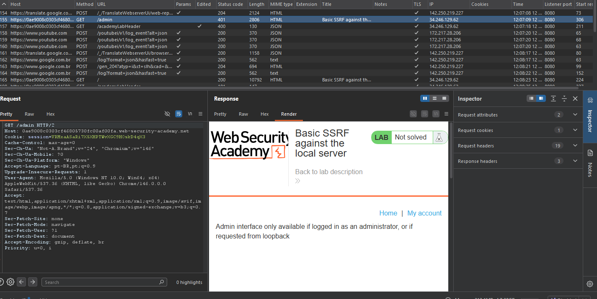
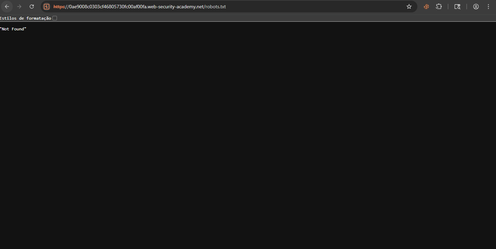
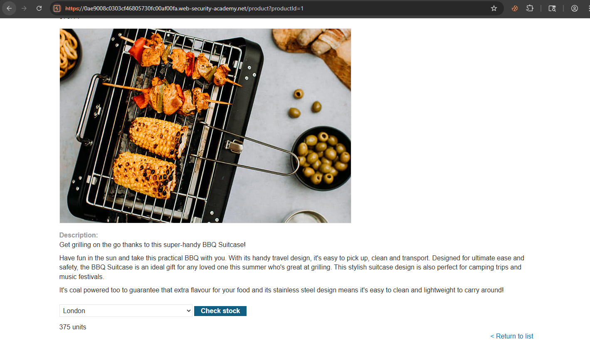
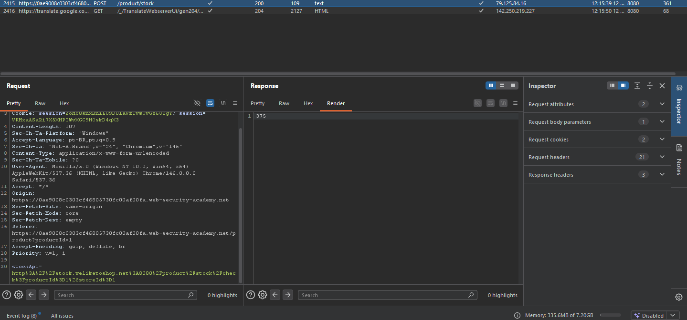
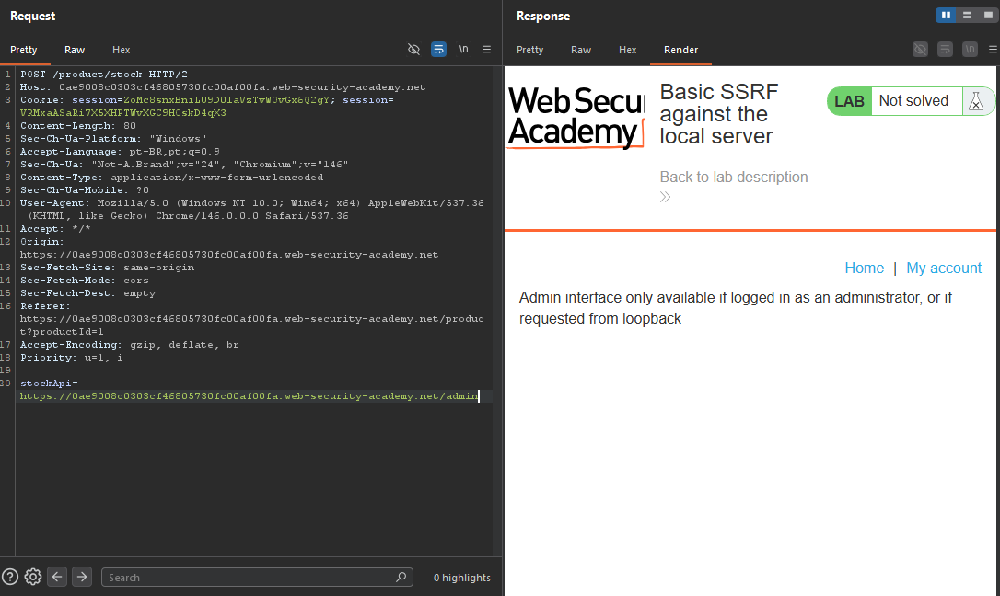
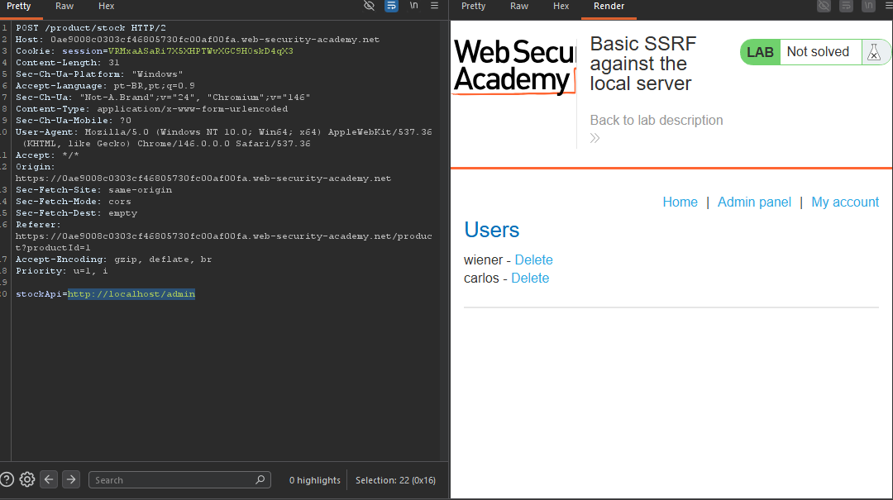
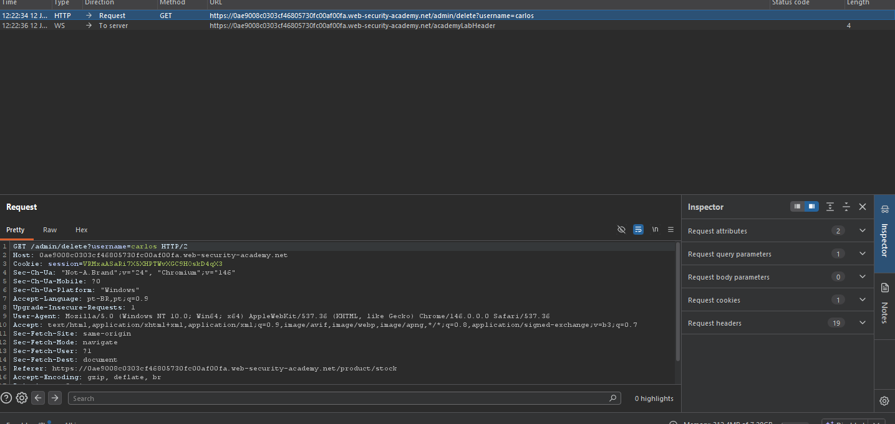
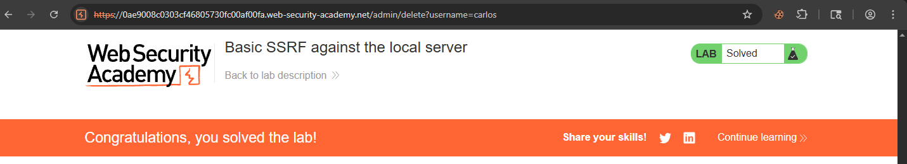

# SSRF — Basic SSRF Against the Local Server

## Contexto

A aplicação possui uma funcionalidade de verificação de estoque que busca dados em um sistema interno. O parâmetro responsável por essa busca é controlado pelo usuário, permitindo alterar a URL que o servidor irá acessar.

**Lab:** Basic SSRF against the local server  
**Objetivo:** acessar o painel administrativo em `http://localhost/admin` e excluir o usuário `carlos`.

---

## Análise Inicial

O objetivo já indicava a existência de um painel em `/admin`. Comecei testando o caminho diretamente pelo navegador, mas a aplicação retornou que o painel só estava disponível para administradores ou para requisições vindas de loopback.



Também testei enumeração básica de arquivos e rotas, como `robots.txt`, mas não havia nenhuma informação útil exposta.



Nesse ponto, os vetores comuns não ajudavam. Não havia indicação útil em `.git`, `robots.txt`, SQL Injection ou XSS. O caminho mais promissor era observar funcionalidades que faziam a aplicação se comunicar com outros sistemas.

---

## Identificação do vetor

Na página de produto, havia a funcionalidade **Check stock**, que consultava a quantidade disponível de um item em determinada loja.



No Burp, a requisição enviada para verificar o estoque continha o parâmetro `stockApi`:

```http
POST /product/stock HTTP/2
Host: 0ae9008c0303cf46805730fc00af00fa.web-security-academy.net
Content-Type: application/x-www-form-urlencoded

stockApi=http%3A%2F%2Fstock.weliketoshop.net%3A8080%2Fproduct%2Fstock%2Fcheck%3FproductId%3D1%26storeId%3D1
```

A resposta retornava apenas a quantidade em estoque:

```txt
375
```



Esse comportamento indicava que o servidor recebia a URL em `stockApi`, fazia a requisição internamente e devolvia a resposta para o usuário. Esse é o ponto central da SSRF: fazer o servidor acessar um recurso escolhido pelo atacante.

---

## Tentativa descartada

Primeiro tentei apontar o `stockApi` para o próprio domínio público do lab:

```txt
stockApi=https://0ae9008c0303cf46805730fc00af00fa.web-security-academy.net/admin
```

A aplicação retornou a mesma mensagem de bloqueio do acesso direto ao painel administrativo.



Essa tentativa falhou porque a requisição chegava ao painel como acesso normal ao host público, não como uma chamada interna via loopback.

---

## Exploração

Voltando para a descrição do lab, o detalhe importante era `http://localhost/admin`. Em SSRF, `localhost` não representa o meu computador. Ele representa o próprio servidor que está processando a requisição.

Então alterei o parâmetro `stockApi` para forçar o servidor a acessar o painel administrativo localmente:

```txt
stockApi=http://localhost/admin
```

Ou codificado em URL:

```txt
stockApi=http%3A%2F%2Flocalhost%2Fadmin
```

Dessa vez, o servidor acessou o próprio painel interno e retornou a interface administrativa com os usuários `wiener` e `carlos`.



A partir do painel, identifiquei o endpoint de exclusão do usuário:

```http
GET /admin/delete?username=carlos HTTP/2
```



O erro inicial foi tentar tratar o painel como se eu já tivesse acesso direto pelo navegador. Mas o acesso só funcionava porque a requisição estava sendo feita pelo servidor via `stockApi`. Portanto, a exclusão também precisava passar pelo mesmo vetor SSRF.

A requisição final foi:

```txt
stockApi=http://localhost/admin/delete?username=carlos
```

Codificada:

```txt
stockApi=http%3A%2F%2Flocalhost%2Fadmin%2Fdelete%3Fusername%3Dcarlos
```

Com isso, o servidor acessou internamente o endpoint administrativo e excluiu o usuário `carlos`, concluindo o lab.



---

## Por que funcionou

A aplicação confiava no valor enviado pelo cliente no parâmetro `stockApi` e fazia uma requisição server-side para a URL informada.

Como não havia validação adequada de destino, foi possível substituir a URL legítima de estoque por uma URL interna:

```txt
http://localhost/admin
```

O painel administrativo bloqueava acessos externos, mas permitia requisições vindas de loopback. A SSRF burlou essa restrição porque quem acessou o painel não foi o navegador do atacante, e sim o próprio servidor da aplicação.

---

## Impacto

Uma SSRF desse tipo permite acessar serviços internos que não deveriam estar expostos ao usuário externo. Em um ambiente real, isso poderia expor painéis administrativos, APIs internas, serviços em portas privadas, metadados de cloud e outros sistemas acessíveis apenas pela rede interna.

Neste lab, o impacto foi controle administrativo suficiente para excluir o usuário `carlos`.

---

## Mitigação

A aplicação não deve aceitar URLs arbitrárias controladas pelo usuário para realizar requisições server-side.

Medidas recomendadas:

- Usar allowlist rígida de domínios e caminhos permitidos.
- Bloquear requisições para `localhost`, `127.0.0.1`, faixas privadas e endereços internos.
- Validar o destino após resolução DNS e após redirects.
- Separar serviços internos sensíveis da aplicação pública.
- Não proteger painéis administrativos apenas por origem da requisição ou acesso via rede local.

---

## Aprendizados

- SSRF acontece quando o usuário consegue controlar para onde o servidor fará uma requisição.
- `localhost` dentro de uma SSRF se refere ao servidor alvo, não à máquina do atacante.
- Testar o domínio público do lab não era suficiente, porque o painel exigia acesso via loopback.
- A exploração não termina ao acessar o painel: a ação final também precisa passar pelo mesmo vetor SSRF.
- Quando uma aplicação retorna a resposta de uma URL enviada pelo usuário, qualquer parâmetro com nome como `url`, `api`, `callback`, `endpoint`, `stockApi` ou `feed` merece atenção.

