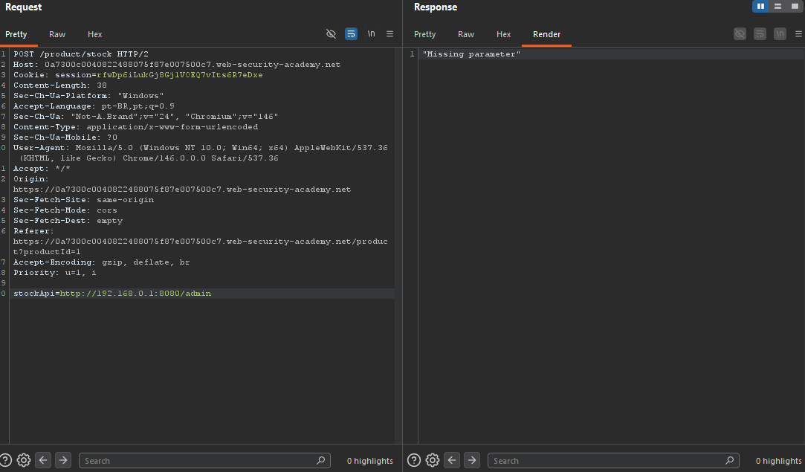
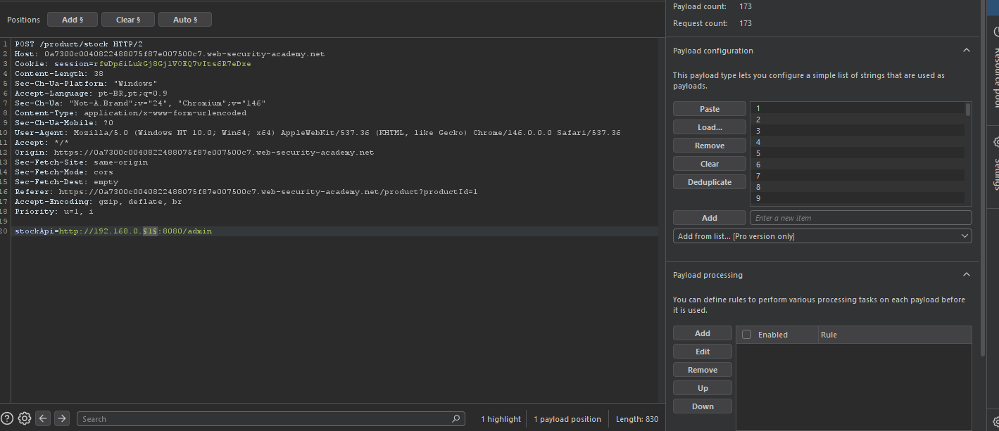
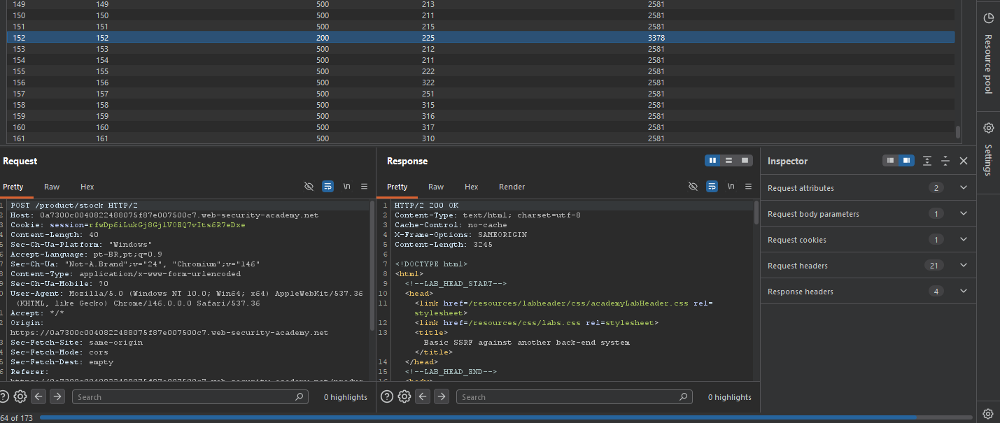
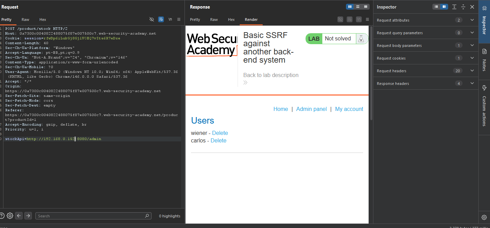
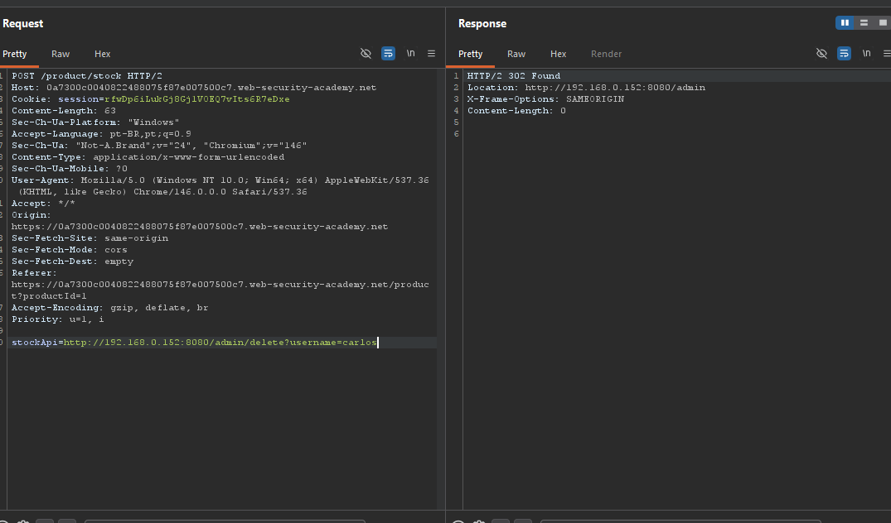

# SSRF — Basic SSRF Against Another Back-End System

## Contexto

A aplicação possui uma funcionalidade de verificação de estoque que recebe uma URL no parâmetro `stockApi` e faz uma requisição para buscar a quantidade disponível do produto.

O objetivo do lab era usar essa funcionalidade para alcançar um sistema interno na faixa `192.168.0.X`, encontrar o painel administrativo rodando na porta `8080` e excluir o usuário `carlos`.

**Lab:** Basic SSRF against another back-end system

---

## Análise Inicial

O lab já indicava que a falha estava na funcionalidade de estoque. Diferente do lab anterior, o alvo não era `localhost`, mas outro sistema interno acessível pela aplicação.

Primeiro testei a URL indicada pela lógica do enunciado:

```http
stockApi=http://192.168.0.1:8080/admin
```

A resposta retornou:

```txt
Missing parameter
```



Essa resposta mostrou que a aplicação estava realmente tentando acessar o endereço interno, mas aquele IP específico não continha o painel administrativo esperado.

---

## Exploração

Como o enunciado informava a faixa `192.168.0.X`, mantive a porta `8080` fixa e usei o Burp Intruder para enumerar o último octeto do IP.

A posição de payload ficou no valor `X`:

```http
stockApi=http://192.168.0.§X§:8080/admin
```



Usei uma lista simples de números de `1` até `255`. O objetivo era encontrar qual host interno respondia de forma diferente.

Durante o ataque, quase todas as respostas retornaram erro `500`. Porém, o IP `192.168.0.152` retornou `200 OK`, indicando que havia um serviço válido naquele endereço.



Com o IP encontrado, enviei a requisição novamente para o Repeater:

```http
stockApi=http://192.168.0.152:8080/admin
```

A aplicação retornou o painel administrativo interno com os usuários `wiener` e `carlos`.



---

## Exclusão do usuário

Acessar o painel ainda não resolvia o lab. O objetivo final era excluir o usuário `carlos`.

Como o painel estava sendo acessado pelo servidor vulnerável, a ação de exclusão também precisava passar pelo parâmetro `stockApi`. Não adiantava acessar o endpoint diretamente pelo navegador, porque o navegador não tinha acesso real ao sistema interno.

Usei o endpoint de exclusão do painel:

```http
stockApi=http://192.168.0.152:8080/admin/delete?username=carlos
```



A resposta retornou `302 Found`, redirecionando de volta para `/admin`. Isso indicou que a ação foi processada corretamente. Após a exclusão, o lab foi concluído.

---

## Por que funcionou

A aplicação aceitava uma URL controlada pelo usuário no parâmetro `stockApi` e fazia a requisição do lado do servidor sem validação adequada.

Isso permitiu transformar a funcionalidade de estoque em um proxy para acessar recursos internos que não estavam disponíveis diretamente pela internet.

O ponto principal é que a requisição partia do servidor da aplicação, não do navegador do atacante. Por isso o servidor conseguia acessar a rede interna `192.168.0.X`, enquanto o navegador externo não conseguiria.

---

## Impacto

Esse tipo de SSRF permite mapear serviços internos, acessar painéis administrativos, consultar sistemas privados e executar ações internas sem autenticação direta.

Em um ambiente real, isso poderia expor interfaces de administração, APIs internas, metadados de cloud, bancos de dados ou serviços que foram protegidos apenas por isolamento de rede.

---

## Mitigação

A aplicação não deve aceitar URLs arbitrárias fornecidas pelo usuário para requisições server-side.

Quando esse tipo de funcionalidade for necessária, é melhor usar uma allowlist rígida de hosts permitidos, bloquear faixas privadas de IP, impedir redirecionamentos para endereços internos e validar a URL no servidor antes da requisição.

Também é importante aplicar autenticação e controle de acesso nos sistemas internos. Rede interna não deve ser tratada como sinônimo de ambiente confiável.

---

## Aprendizados

- SSRF pode ser usado não só para acessar `localhost`, mas também para enumerar redes internas.
- Nesse lab, o fuzzing foi feito no último octeto do IP `192.168.0.X`, mantendo a porta `8080` fixa.
- Diferenças em status code e tamanho da resposta ajudam a identificar hosts internos válidos.
- Encontrar o painel não basta — a ação final também precisa passar pelo vetor SSRF.
- Serviços internos não devem confiar apenas no fato de estarem fora da internet pública.
