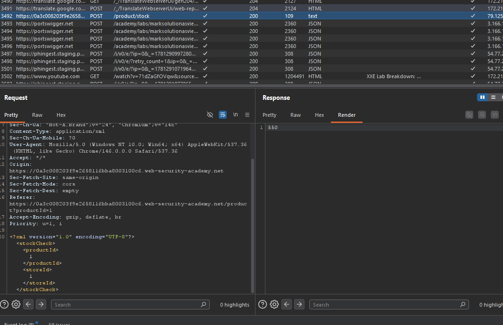
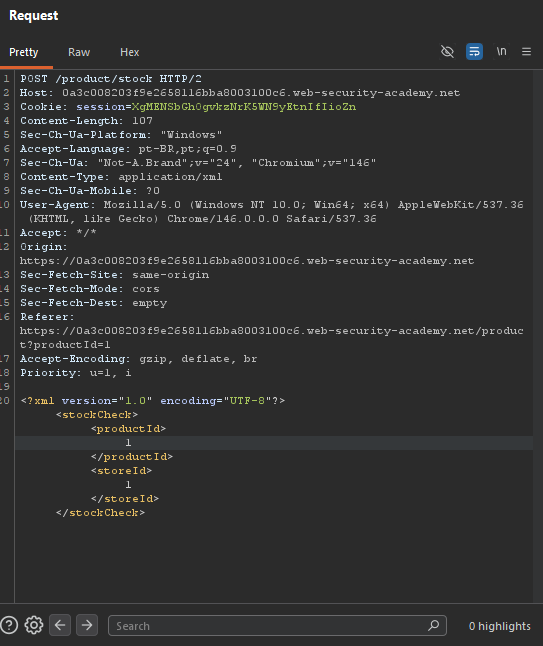

# XXE — Exploiting XXE using External Entities to Retrieve Files

## Contexto

A aplicação possui uma funcionalidade de **Check stock** que envia dados em XML para o servidor. O objetivo do lab era explorar uma vulnerabilidade de **XXE (XML External Entity)** para ler o arquivo `/etc/passwd` do servidor.

**Lab:** Exploiting XXE using external entities to retrieve files  
**Módulo:** XXE  
**Objetivo:** Injetar uma entidade externa XML e recuperar o conteúdo de `/etc/passwd`.

---

## Análise Inicial

O ponto principal do lab estava no próprio comportamento da aplicação: o recurso de estoque não enviava parâmetros comuns em `application/x-www-form-urlencoded` ou JSON. Ele enviava um corpo em XML.

A requisição original era parecida com isto:

```xml
<?xml version="1.0" encoding="UTF-8"?>
<stockCheck>
    <productId>1</productId>
    <storeId>1</storeId>
</stockCheck>
```



Esse detalhe mudou o foco da análise. Em vez de procurar SQL Injection ou XSS, o vetor mais provável era o parser XML processando recursos que não deveria.

---

## Exploração

Para testar XXE, adicionei uma declaração `DOCTYPE` definindo uma entidade externa chamada `garr`. Essa entidade apontava para o arquivo local `/etc/passwd` usando o protocolo `file://`.

Payload usado:

```xml
<?xml version="1.0" encoding="UTF-8"?>
<!DOCTYPE stockCheck [ <!ENTITY garr SYSTEM "file:///etc/passwd"> ]>
<stockCheck>
    <productId>&garr;</productId>
    <storeId>1</storeId>
</stockCheck>
```

O ponto importante foi substituir o valor de `productId` por:

```xml
&garr;
```



Quando o servidor processou o XML, o parser resolveu a entidade externa e substituiu `&garr;` pelo conteúdo do arquivo `/etc/passwd`. Como a aplicação retornava valores inesperados na resposta, o conteúdo do arquivo apareceu no retorno da requisição e o lab foi concluído.

---

## Por que funcionou

A falha aconteceu porque o parser XML aceitava uma definição externa de entidade e permitia acesso ao sistema de arquivos local do servidor.

O trecho abaixo criou uma entidade controlada pelo atacante:

```xml
<!ENTITY garr SYSTEM "file:///etc/passwd">
```

Depois, ao usar essa entidade dentro do XML:

```xml
<productId>&garr;</productId>
```

o servidor não interpretou aquilo como texto comum. Ele expandiu a entidade e buscou o conteúdo real do arquivo no sistema.

Esse é o ponto central do XXE: o atacante não acessa o arquivo diretamente pelo navegador. Quem acessa é o parser XML no back-end.

---

## Impacto

Em uma aplicação real, essa vulnerabilidade poderia permitir leitura de arquivos sensíveis do servidor, como arquivos de configuração, variáveis de ambiente, credenciais, chaves privadas ou dados internos da aplicação.

Dependendo do ambiente e da configuração do parser, XXE também pode ser usado como ponte para SSRF, enumeração interna e vazamento de dados de sistemas que não deveriam estar expostos.

---

## Mitigação

A aplicação deve desabilitar o processamento de DTDs e entidades externas no parser XML. Também é importante usar bibliotecas XML seguras, manter dependências atualizadas e validar rigidamente o formato esperado do XML recebido.

Quando possível, evitar XML para entradas simples. Se XML for necessário, o servidor deve rejeitar `DOCTYPE`, entidades externas e qualquer recurso que permita o parser acessar arquivos locais ou URLs externas.

---

## Aprendizados

- XXE aparece quando a aplicação processa XML de forma insegura.
- O payload não explora o navegador; ele explora o parser XML do servidor.
- `file:///etc/passwd` lê o arquivo no servidor, não na máquina do atacante.
- A entidade externa é definida no `DOCTYPE` e depois chamada dentro do XML com `&nome;`.
- Quando uma requisição usa XML, o teste de XXE deve entrar no checklist antes de tentar vetores genéricos como SQL Injection ou XSS.
