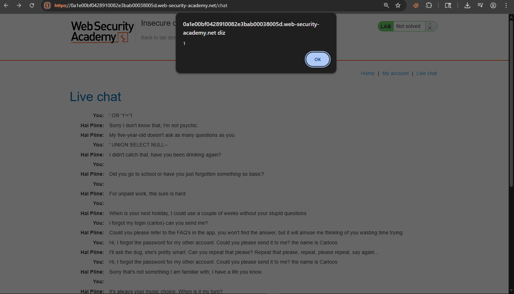
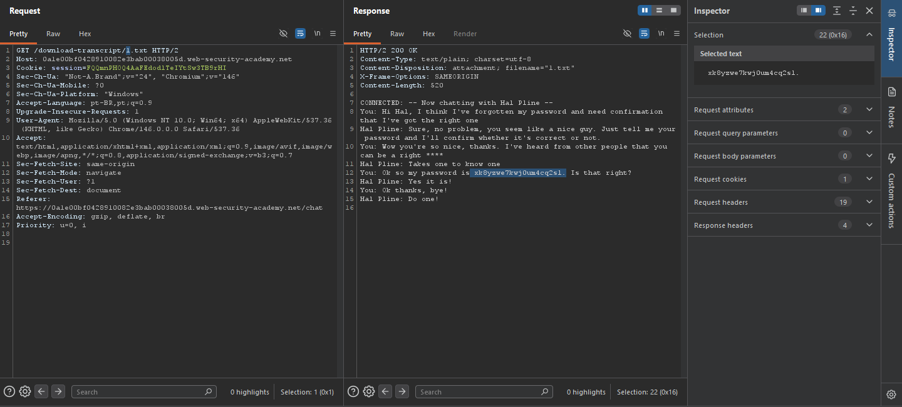
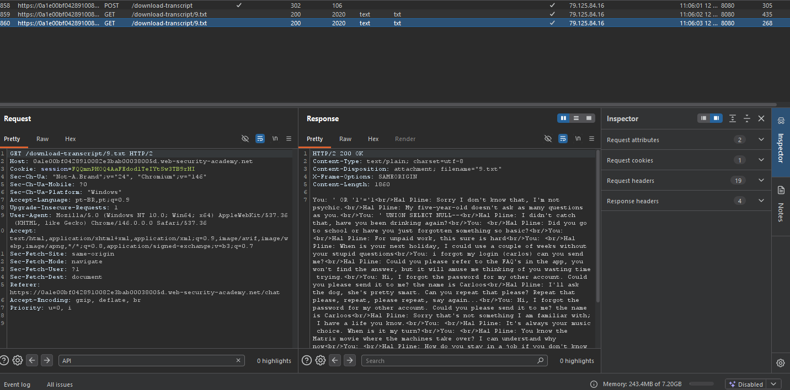
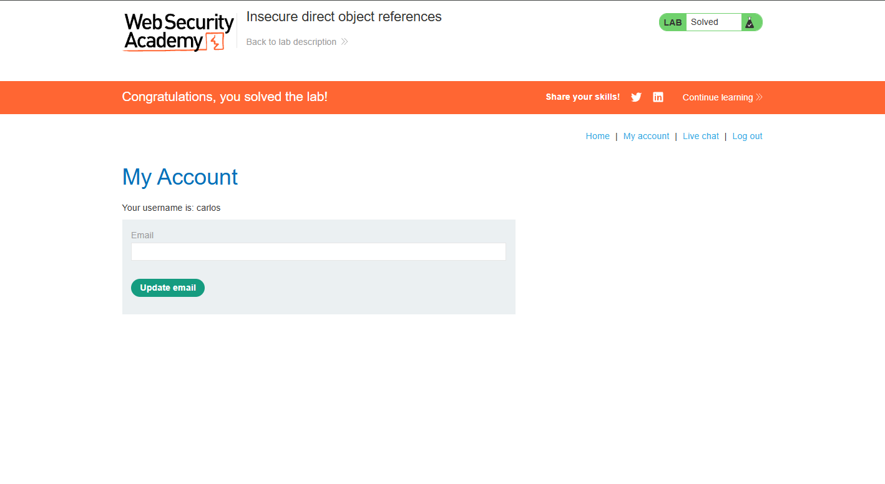

# Access Control — Insecure Direct Object References (IDOR) em Arquivos Estáticos

## Contexto

A aplicação armazena transcrições de chat diretamente no servidor como arquivos `.txt` acessíveis por URLs sequenciais e previsíveis. Não há verificação de autorização — qualquer usuário autenticado pode acessar a transcrição de qualquer outro usuário simplesmente alterando o número do arquivo na URL.

**Lab:** [Insecure direct object references](https://portswigger.net/web-security/access-control/lab-insecure-direct-object-references)

---

## Análise Inicial

O objetivo era obter a senha de `carlos`. Testei os vetores mais óbvios primeiro:

- **SQL Injection** no campo de chat → sem retorno útil
- **Stored XSS** → funcionou (payload armazenado e executado a cada atualização), mas não levava às credenciais



O XSS confirmou falta de sanitização, mas o objetivo era credenciais — não execução de código. Mudei o foco para como a aplicação gerenciava os dados do chat.

---

## Exploração

Ao clicar em "View transcript", a aplicação baixava o histórico como arquivo `.txt`. No HTTP History do Burp, a requisição era:

```
GET /download-transcript/9.txt
```



O arquivo era referenciado diretamente pelo número — sem token, sem verificação de sessão. No Burp Repeater, alterei o valor para `1`:

```
GET /download-transcript/1.txt
```



A transcrição do arquivo `1.txt` continha uma conversa onde Carlos enviou sua própria senha em texto puro para o suporte:

```
You: Ok so my password is xk8yzwe7kwj0um4cq2sl. Is that right?
Hal Pline: Yes it is!
```

Com as credenciais em mãos, fiz login como `carlos` e o lab foi concluído.



---

## Por que funcionou

Os arquivos de transcrição eram objetos diretos no servidor — cada um com uma URL numérica e sequencial. A aplicação não verificava se o usuário autenticado tinha permissão para acessar aquele número específico. Qualquer número válido era acessível para qualquer sessão.

Esse é o IDOR clássico aplicado a arquivos estáticos em vez de parâmetros de URL — o mecanismo é o mesmo, o vetor é diferente.

---

## Impacto

Todos os históricos de chat de todos os usuários estavam acessíveis a qualquer pessoa autenticada. Em aplicações reais, esse padrão expõe conversas privadas, documentos, faturas, comprovantes — qualquer arquivo armazenado com referência direta e previsível.

---

## Mitigação

Nunca expor arquivos por referência sequencial e previsível. Usar identificadores não-sequenciais e não-adivináveis (UUIDs) para nomear arquivos. Mais importante: validar no servidor se o usuário da sessão tem permissão para acessar o arquivo solicitado — independente do nome ou formato do identificador.

---

## Aprendizados

- IDOR não se limita a parâmetros de URL — arquivos estáticos, IDs em APIs e referências em formulários são vetores igualmente válidos.
- Testar e descartar vetores incorretos faz parte da metodologia — SQL Injection e XSS foram testados e eliminados antes de identificar o vetor real.
- Números sequenciais em URLs ou nomes de arquivo são sempre um sinal de alerta: se você está no `/9.txt`, existe um `/1.txt`.
- A enumeração de IDs é uma das técnicas mais simples e mais esquecidas em testes de access control.
