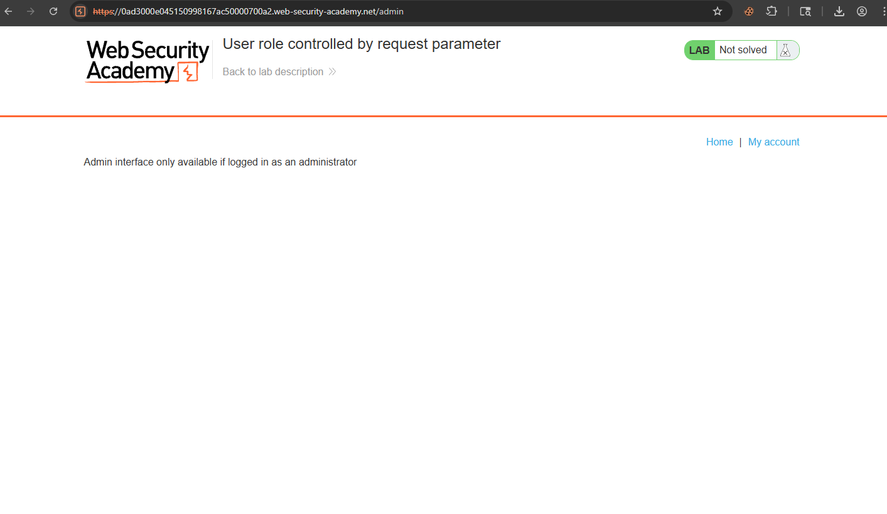
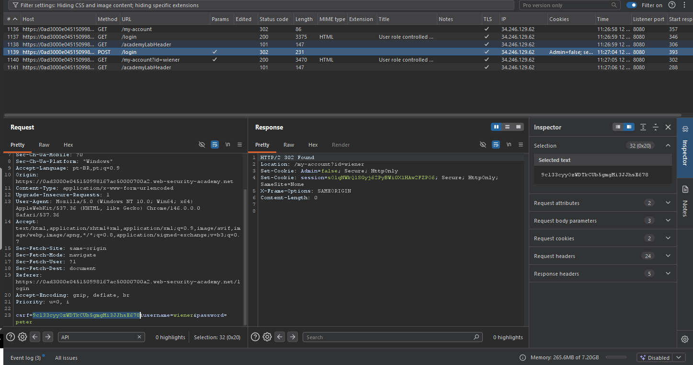
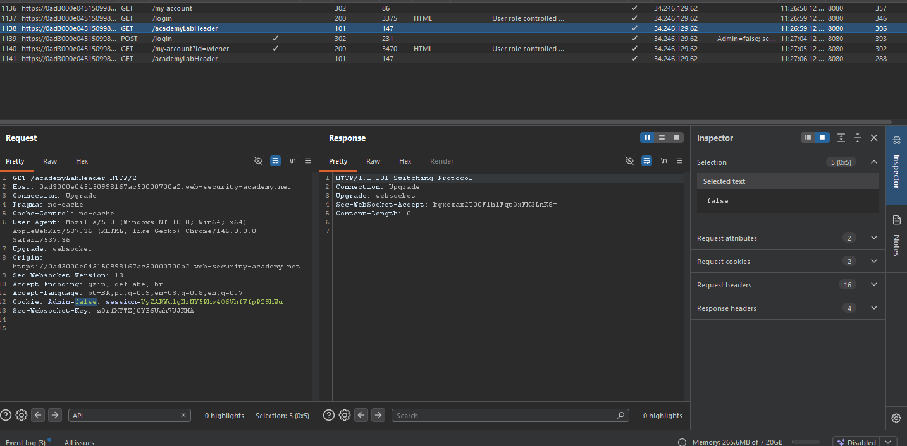
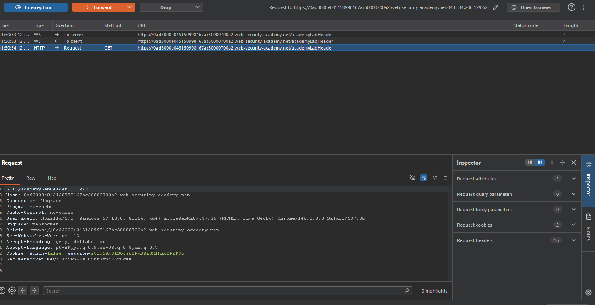
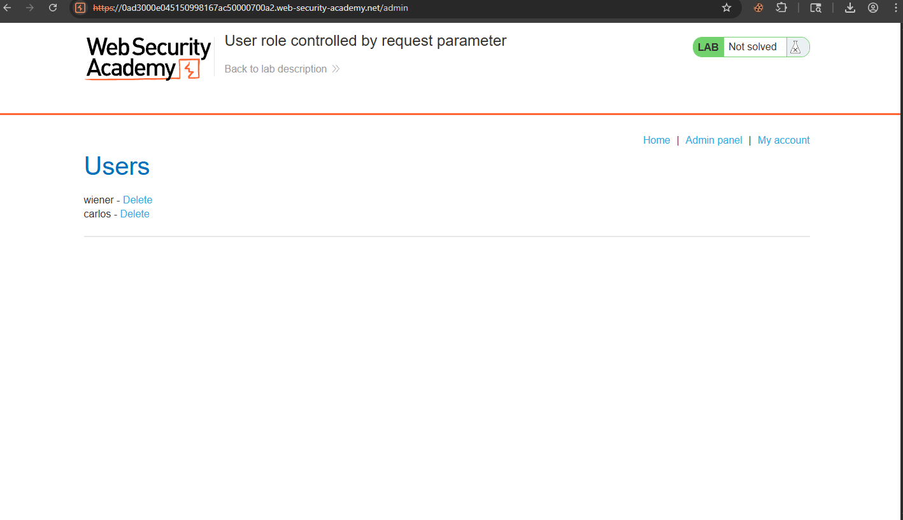
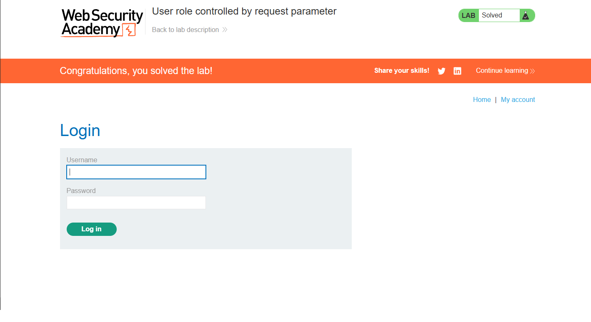

# Access Control — User Role Controlled by Request Parameter

## Contexto

A aplicação possui um painel administrativo em `/admin`, mas o controle de acesso depende de um valor enviado pelo próprio cliente. Após o login, o servidor define um cookie indicando se o usuário é administrador ou não.

**Lab:** [User role controlled by request parameter](https://portswigger.net/web-security/access-control/lab-user-role-controlled-by-request-parameter)

---

## Análise Inicial

O objetivo era acessar o painel administrativo e excluir o usuário `carlos`.

Como a própria descrição do lab informava que existia um painel em `/admin`, testei primeiro o acesso direto à rota:

```http
GET /admin HTTP/2
```

A aplicação retornou a mensagem informando que a interface administrativa só estava disponível para administradores.



Também testei o caminho mais comum de enumeração de rotas:

```http
GET /robots.txt HTTP/2
```

Esse teste não retornou nenhuma informação útil para o objetivo do lab. Como o problema envolvia controle de permissão, o próximo passo foi analisar o fluxo de login e os cookies gerados pela aplicação.

---

## Exploração

Após fazer login com as credenciais fornecidas:

```txt
wiener:peter
```

observei no Burp que a resposta do login criava um cookie chamado `Admin` com o valor `false`:

```http
Set-Cookie: Admin=false; Secure; HttpOnly
```



Esse foi o ponto principal do lab. A aplicação estava armazenando o papel do usuário em um cookie controlável pelo cliente. Mesmo com `HttpOnly`, o valor ainda podia ser alterado manualmente via Burp antes da requisição chegar ao servidor.

No histórico do Burp, também era possível ver requisições autenticadas carregando o cookie `Admin=false`:



Com o Intercept ligado, acessei novamente `/admin` e alterei o cookie de:

```http
Cookie: Admin=false; session=...
```

para:

```http
Cookie: Admin=true; session=...
```



Depois de encaminhar a requisição modificada, a aplicação aceitou o acesso ao painel administrativo e exibiu os usuários disponíveis.



---

## Erro durante a exploração

O lab não terminava apenas acessando o painel. O objetivo final era excluir o usuário `carlos`.

Ao clicar em `Delete`, a aplicação fazia uma nova requisição. Nessa nova requisição, o navegador voltava a enviar o cookie original:

```http
Admin=false
```

Por isso, ao tentar excluir o usuário, a aplicação retornava novamente:

```txt
Admin interface only available if logged in as an administrator
```

A correção foi repetir a alteração do cookie em todas as requisições necessárias:

```http
Admin=false  →  Admin=true
```

Depois de modificar o cookie novamente na requisição de exclusão, o usuário `carlos` foi removido e o lab foi concluído.



---

## Por que funcionou

A aplicação confiava em um parâmetro enviado pelo cliente para determinar se o usuário era administrador. Esse valor estava em um cookie simples:

```http
Admin=false
```

Como cookies fazem parte da requisição HTTP e podem ser manipulados pelo usuário, qualquer lógica crítica baseada apenas nesse valor é insegura.

O servidor deveria validar a permissão do usuário com base em dados confiáveis no backend, não em um campo controlável pelo cliente.

---

## Impacto

Um usuário comum conseguia se promover a administrador apenas alterando um cookie. Em uma aplicação real, isso permitiria acesso indevido a painéis internos, exclusão de usuários, alteração de dados sensíveis e abuso de funcionalidades administrativas.

Esse tipo de falha é grave porque quebra completamente o modelo de autorização da aplicação.

---

## Mitigação

A aplicação não deve confiar em cookies, parâmetros de URL, campos ocultos ou qualquer dado controlado pelo cliente para definir privilégios.

O correto é armazenar o papel do usuário no servidor e verificar a autorização em cada requisição sensível. Mesmo que exista um cookie de sessão, ele deve servir apenas para identificar a sessão; a permissão real deve ser consultada e validada no backend.

Também é importante validar autorização em todas as ações administrativas, não apenas no carregamento inicial do painel.

---

## Aprendizados

- Controle de acesso nunca deve depender de valores controláveis pelo cliente.
- Cookies também são parâmetros de entrada e devem ser tratados como dados manipuláveis.
- `HttpOnly` impede acesso via JavaScript, mas não impede alteração manual via proxy como Burp Suite.
- Acessar o painel não era suficiente — a ação de excluir `carlos` também precisava ser feita com o cookie `Admin=true`.
- Quando uma aplicação “volta” para o estado anterior, vale revisar se uma nova requisição está usando novamente o valor original.
