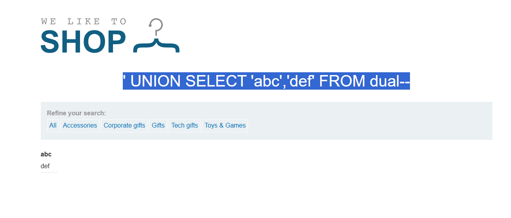
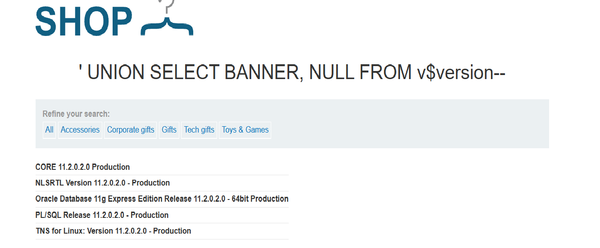

# SQL Injection - Querying Database Type and Version (Oracle)

## Objetivo

Identificar o tipo e a versão do banco Oracle utilizando SQL Injection com `UNION`.

---

## Payload utilizado

```sql
' UNION SELECT 'abc','def' FROM dual--
```

## Screenshot



---

## Como funciona

- `UNION` junta a consulta injetada com a original
- `abc` e `def` foram usados apenas para testar a quantidade de colunas
- `dual` é uma tabela especial do Oracle

Resultado do teste:

- Existem 2 colunas
- Ambas aceitam texto

---

## Extração de informações

```sql
' UNION SELECT BANNER,NULL FROM v$version--
```

## Screenshot



---

## Resultado

Foi possível identificar:

- Oracle Database 11g
- Versão específica
- Informações do ambiente

---

## Aprendizado

Antes de extrair dados reais, foi necessário entender a estrutura da query, descobrir a quantidade de colunas e identificar quais aceitavam texto.
