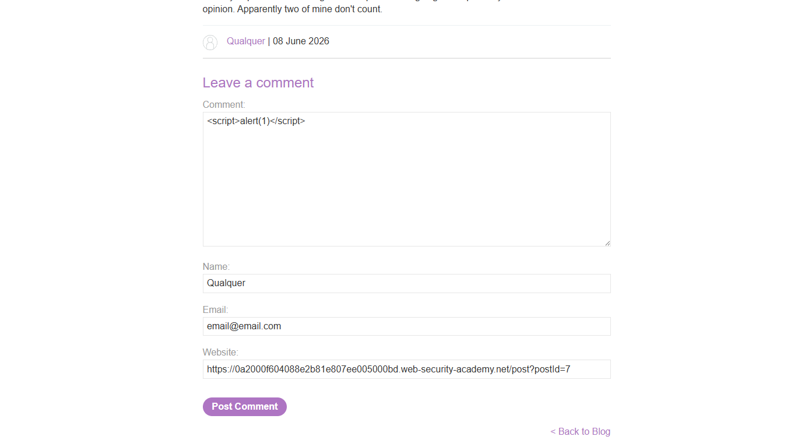
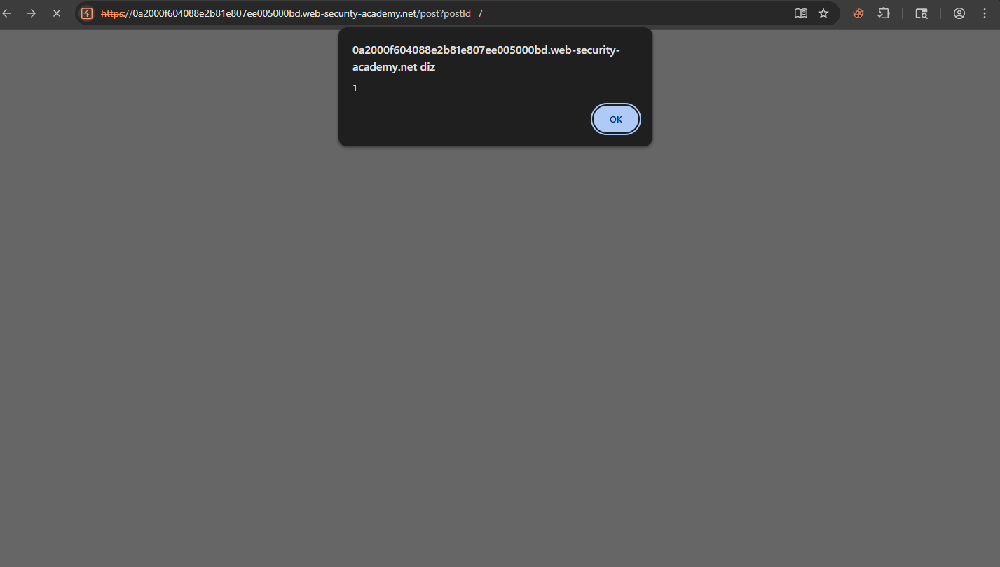

# Stored XSS — HTML Context sem Encoding

## Contexto

A seção de comentários de um blog armazena o input do usuário no banco de dados e o renderiza diretamente na página sem nenhum tratamento. Diferente do XSS refletido, o payload fica persistido — qualquer visitante que abrir o post executa o script automaticamente, sem precisar clicar em nenhum link.

---

## Análise inicial

O formulário de comentários aceitava quatro campos: `Comment`, `Name`, `Email` e `Website`. O campo `Comment` era o vetor — o conteúdo era salvo e renderizado cru no HTML da página do post.



---

## Exploração

Payload inserido no campo de comentário:

```html
<script>alert(1)</script>
```

Após submeter, o payload foi salvo no banco de dados. Toda vez que a página do post era carregada, o browser interpretava o comentário como HTML e executava o script — disparando o `alert(1)` automaticamente, sem nenhuma interação adicional.



---

## Diferença crítica em relação ao Reflected XSS

No XSS refletido o payload some depois de um request — a vítima precisa clicar num link malicioso. Aqui o payload está no banco de dados: cada visitante que abrir a página executa o script. Um post popular com esse vetor comprometeria todos os leitores simultaneamente.

---

## Impacto

Em ambiente real, o payload roubaria o cookie de sessão de cada visitante e enviaria para um servidor controlado pelo atacante — comprometendo todas as contas que acessassem o post. Quanto mais visitado o conteúdo, maior o alcance do ataque, sem nenhuma ação adicional do atacante após a injeção inicial.

---

## Mitigação

Escapar caracteres HTML especiais antes de salvar ou renderizar qualquer input do usuário. O campo de comentário deveria armazenar e exibir `&lt;script&gt;alert(1)&lt;/script&gt;` como texto — não como tag executável. A correção precisa acontecer na renderização, não apenas na validação do formulário.
