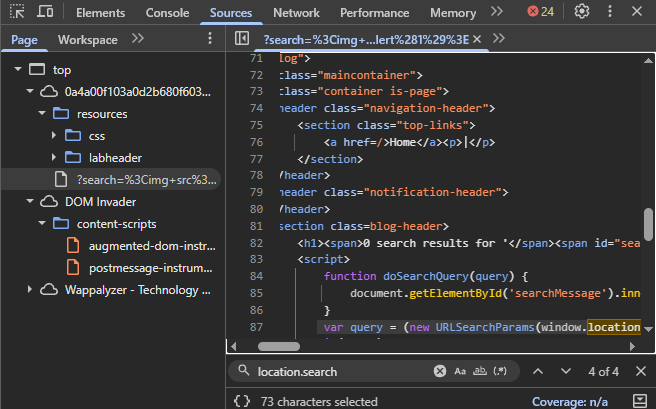

# DOM XSS — innerHTML Sink via location.search

## Contexto

A aplicação usa JavaScript do lado do cliente para pegar o termo de busca da URL e injetá-lo diretamente no HTML da página via `innerHTML`. O problema não passa pelo servidor — o próprio código JavaScript da página cria a vulnerabilidade. Esse é o ponto central que diferencia DOM XSS dos outros tipos: o servidor é inocente, o vetor é o JS do front-end.

---

## Análise inicial

Nenhum payload funcionou de imediato. Em vez de testar às cegas, abri o DevTools → aba **Sources** e busquei por `location.search` — qualquer ponto onde a URL é lida como input é um vetor potencial.

O código encontrado:

```javascript
function doSearchQuery(query) {
    document.getElementById('searchMessage').innerHTML = query;
}

var query = (new URLSearchParams(window.location.search)).get('search');
if(query) {
    doSearchQuery(query);
}
```



O fluxo é direto: o parâmetro `search` da URL é lido via `location.search`, passado para `doSearchQuery()` e jogado cru dentro de `innerHTML`. Qualquer HTML injetado ali é renderizado e executado pelo browser.

---

## Exploração

`<script>` tags não funcionam via `innerHTML` — o browser ignora scripts inseridos dessa forma. O vetor correto é um elemento com event handler que dispara automaticamente:

```html

```

O browser tenta carregar a imagem com `src=1`, falha (fonte inválida), e executa o `onerror` como consequência. Nenhuma interação necessária além de carregar a página.


---

## Payloads alternativos para innerHTML

Quando o sink é `innerHTML`, qualquer elemento com event handler é um vetor válido. Outros payloads que funcionam no mesmo contexto:

```html
<iframe src=javascript:alert(1)>
```
O `iframe` executa o protocolo `javascript:` diretamente como fonte — sem depender de erro de carregamento.

```html
<body onload=alert(1)>
```
Injeta uma tag `<body>` com evento `onload` — dispara assim que o elemento é parseado pelo browser.

A lógica é sempre a mesma: encontrar um elemento HTML que execute código sem precisar de uma tag `<script>`. Qualquer atributo de evento (`onerror`, `onload`, `onmouseover`, `onfocus`) é um vetor potencial dependendo do contexto.

---

## Por que `<script>` não funciona aqui

Essa distinção é importante: `innerHTML` não executa tags `<script>` por especificação do HTML. Isso não significa que o vetor é seguro — significa que o payload precisa usar um event handler em vez de uma tag de script direta. Qualquer elemento HTML com atributo de evento (`onerror`, `onload`, `onmouseover`) é um vetor válido.

---

## Impacto

O ataque acontece inteiramente no browser da vítima, sem passar pelo servidor. Distribuindo um link com o payload na URL, qualquer pessoa que clicar executa o script no próprio contexto — com acesso a cookies, tokens e a capacidade de agir em nome do usuário.

---

## Mitigação

Nunca usar `innerHTML` para inserir dados controlados pelo usuário. A correção é usar `textContent` no lugar — ele trata o valor como texto puro e nunca interpreta como HTML:

```javascript
document.getElementById('searchMessage').textContent = query;
```

Alternativamente, sanitizar o input com uma biblioteca como DOMPurify antes de qualquer inserção no DOM.
